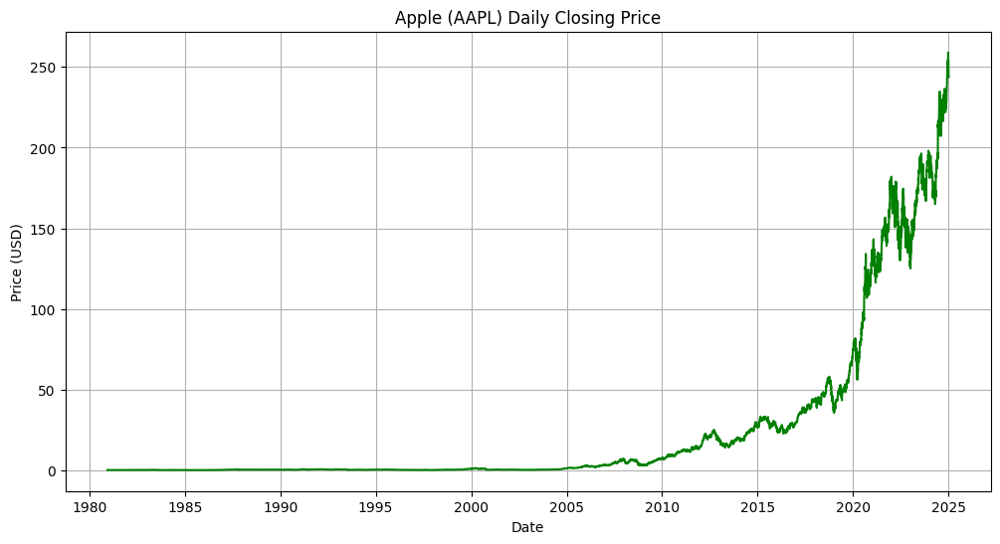
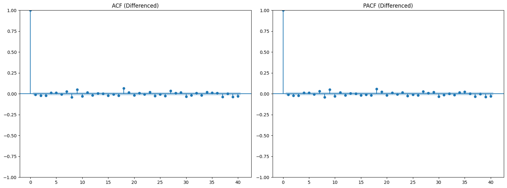
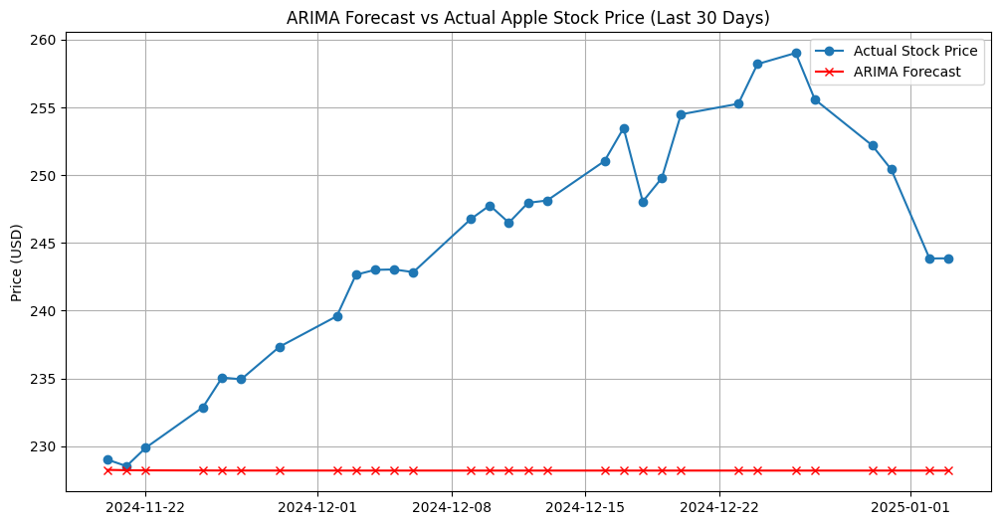

# Apple Stock Price Forecasting (ARIMA) 📈

This repository contains a univariate time series analysis and forecasting model for Apple Inc. (AAPL) daily stock prices using an ARIMA (AutoRegressive Integrated Moving Average) model.

## 📊 Dataset
The dataset consists of historical daily stock prices for Apple Inc., sourced from Kaggle. For this model, the analysis focuses exclusively on the `Date` (index) and `Close` (Daily Closing Price in USD) variables.
* **Link:** [Apple Stock Data 2025 (Kaggle)](https://www.kaggle.com/datasets/umerhaddii/apple-stock-data-2025)

## 🛠️ Methodology
Financial market data is inherently non-stationary due to long-term economic growth. 
1. **Pre-processing:** Date strings were converted to standard datetime objects and set as the chronological index.
2. **Stationarity:** An Augmented Dickey-Fuller (ADF) test confirmed the raw data was non-stationary (p-value: 1.00000). First-order differencing ($d=1$) was applied to stabilize the mean, resulting in a stationary dataset (p-value: 0.00000).
3. **Parameter Selection:** Based on ACF and PACF plots exhibiting a "random walk," the baseline parameters for AutoRegressive ($p$) and Moving Average ($q$) were set to 1. The final model order is **ARIMA(1, 1, 1)**.

## 🚀 Results
The dataset was split chronologically, with the final 30 days held out for testing. The model generated the following error metrics:
* **Mean Absolute Error (MAE):** $16.84
* **Root Mean Squared Error (RMSE):** $18.85
* **Mean Absolute Percentage Error (MAPE):** 6.76%

## 💡 Conclusion
The ARIMA model produced a MAPE of roughly 6.7%. Visually, the forecast acts as a smoothed moving average; it successfully identifies the general baseline price level (around $230-$250) but fails to capture sharp, daily volatility. Because stock prices behave like a random walk heavily influenced by unpredictable external factors, this model provides a mathematically sound baseline trend, but would carry high risk for precise day trading.

## 💻 How to Run
1. Clone this repository.
2. Ensure you have `apple_stock.csv` in the root directory.
3. Run `python arima_model.py` (or execute the Jupyter Notebook).
